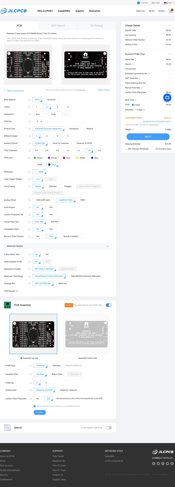
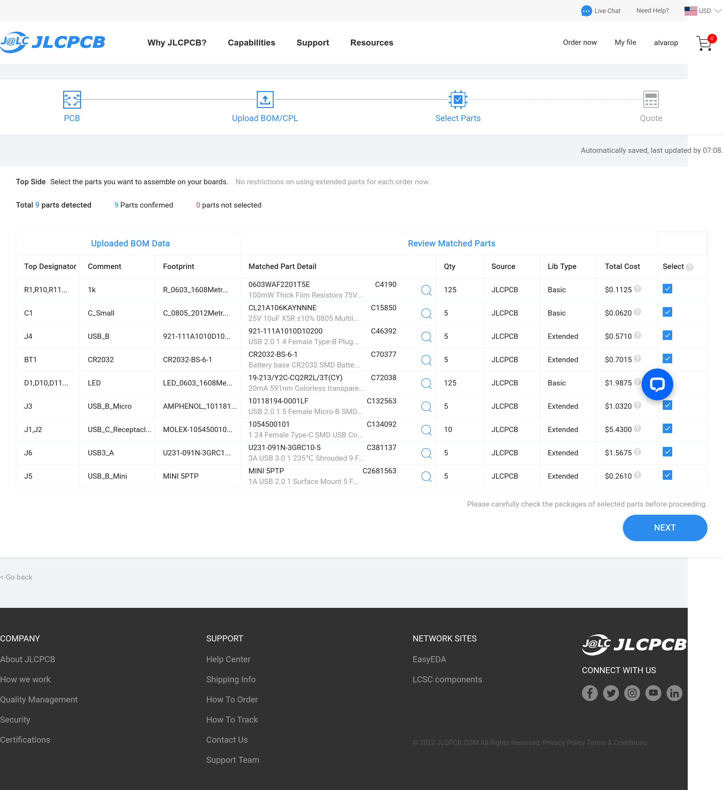
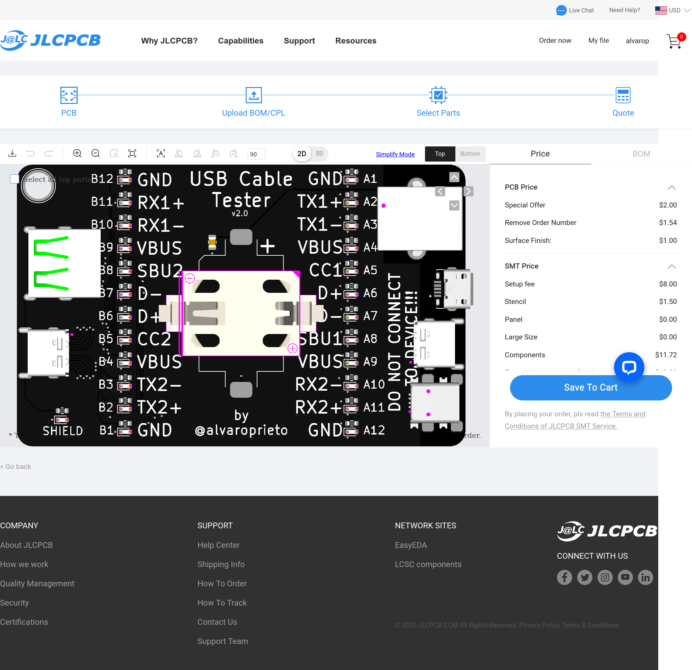
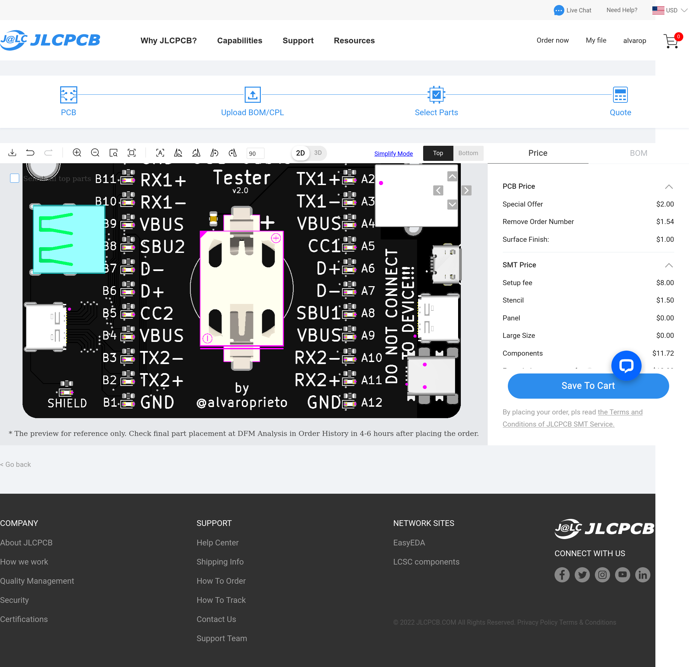
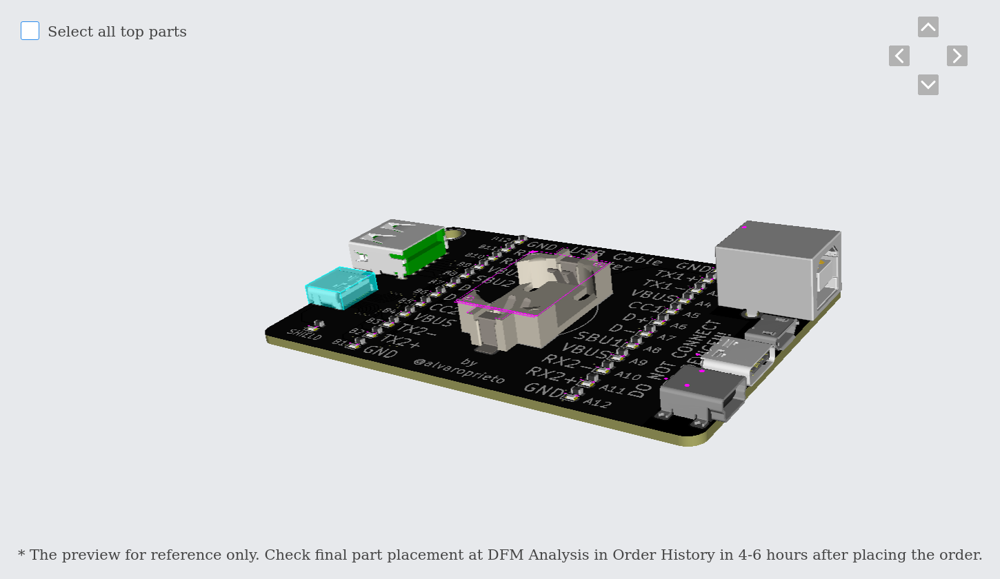
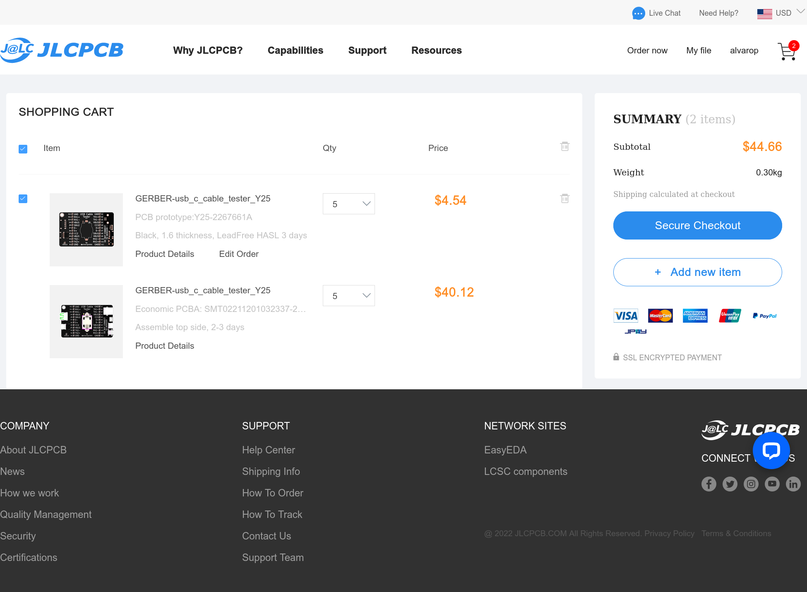

# Ordering Instructions on [JLCPCB](https://jlcpcb.com/).

## Download Files
Download jlcpcb.zip from [releases page](https://github.com/alvarop/usb_c_cable_tester/releases)

Unzip the `jlcpcb.zip` file, and you should find three files used below:

* `gerber/GERBER-usb_c_cable_tester.zip` -- PCB Manufacturing Gerber files (first upload page)

* `assembly/BOM-usb_c_cable_tester.csv` -- Component Bill of Materials (second upload page)

* `assembly/POS-usb_c_cable_tester.csv` -- Component Positions (second upload page)

(There is also another copy of the Gerber files in the `gerber/`
directory of the main zip file, but uploading the whole `jlcpcb.zip`
will confuse the JLCPCB techs and cause them to ask questions.  So unzip
the `jlcpcb.zip` first :-) )

## Upload Gerbers and Select PCB Parameters
Go to JLCPCB, click on "instant quote" or "order now" and upload the file GERBER-usb_c_cable_tester.zip

Select the following settings (or change how you like them)
> ENIG will look better, but it's a bit more expensive. I definitely recommend lead free HASL at the very least

Make sure you select PCB Assembly as well then click Next

# Upload BOM and Placement files

Verify BOM

## Fix Component Placement
Verify component placement (it's not quite right by default)

First, rotate the battery holder 90 degrees to the left

 
Then select each USB connector and use the arrows on the top right to move it into place

You can change the view to the back to make sure the pins line up

The 3d view is also quite useful when trying to line things up

## Checkout!

## Additional Notes
[There have been reports](https://github.com/alvarop/usb_c_cable_tester/issues/15) of JLC asking if all the pins on one side should be shorted together. The answer is yes, this is on purpose :D
