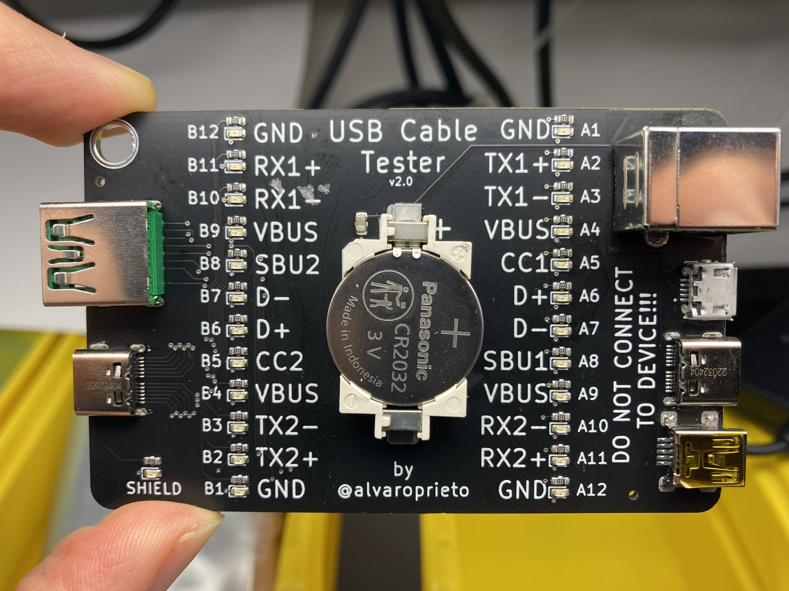
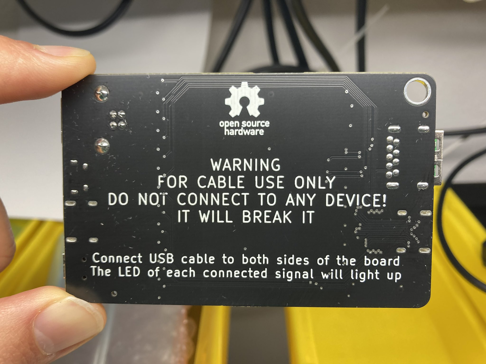

# USB Cable Tester

Simple board to test various USB cables!

Plug in your cable to both sides and see which signals light up!

**FOR CABLE USE ONLY. DO NOT EVER PLUG THIS IN TO A DEVICE, THE PINS ON ONE SIDE ARE ALL SHORTED TOGETHER AND THAT COULD BREAK IT!**

## License
USB Cable Tester © 2022 by Alvaro Prieto is licensed under CC BY 4.0. To view a copy of this license, visit http://creativecommons.org/licenses/by/4.0/
